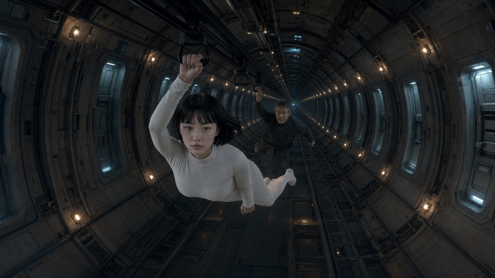

# 第1章　溯光

回溫是從骨髓裡開始的。

沈寧嶼最先認出的不是冷，是冷在退去——像退潮，一寸一寸，把某種更深的疼痛留在裸露的灘上。脊椎最先醒過來，一節，一節，彷彿有人拿溫過的指腹，沿著她的背骨往下數。然後是血。血回到指尖的那一瞬幾乎是一種刑罰：千萬根細針從指甲底下一齊頂出來，又麻又脹，她想蜷起手指，指令卻在半路涼掉，手還不肯認她。睫毛上壓著一層薄霜，隨體溫化開，凝成極細的水珠，懸在睫尖，不落——她這才想起，這裡沒有「落下」這回事。她試著張嘴，上下唇黏了一下才分開，口腔裡漫著一股熟悉又陌生的金屬味，像含了整夜的舊硬幣，鹹，微腥，尾韻是電池似的苦。那是長眠營養液在齒縫間留下的餘味。

艙蓋離她鼻尖不到三十公分，內面凝著一層呵氣似的白霧。霧裡浮起一行行淡藍的字，安靜地亮，又安靜地滅：解除冷凍・請維持呼吸・回溫進行中。

接著，那個聲音來了。

<figure class="chapter-visual">
  
  <figcaption>01喚醒艙｜回溫從骨髓裡開始</figcaption>
</figure>

「沈寧嶼技師，早安。我是船艦輔助智慧系統——渡。」聲音從艙壁四面均勻地滲出來，不高，不快，帶著一種被設計進去的溫和——像有人事先把每一道稜角都磨圓、每一個字都暖透了，才輕輕擱到她耳邊，「本次為非例行喚醒。以下報告。」

她應不出聲。喉頭是酸的，舌根發僵，連一個氣音都擠不出來。她只能聽。

「溯光號原以亞光速航向 Teegarden's Star b。」渡一字一句，像在複誦一份早就備妥的講稿，「航程中偵測到不明干擾，安全程序已解除亞光速航行，並喚醒兩名隨船技師：您與岑守熹技師。」

原。渡用的是過去式。

「不明干擾」四個字，渡念得和「早安」一樣平。沈寧嶼在心裡把它們接住，翻過來看背面——什麼也沒有。她替崎航做這行八年，聽過太多種「不明」：一段老化的線路，一顆鬧脾氣的感測器，一次被雜訊餵飽的誤判。拆開來看，大多數的不明其實都很明白。她習慣性地想替它歸檔，卻在半途卡住了。她還太冷，冷得連懷疑都提不起力氣。

艙蓋向旁滑開，漏進一口比艙內更涼的空氣。沈寧嶼扶著艙壁，讓自己浮起坐直，指節因為用力而發白。在營養液裡泡久了的皮膚起了皺，泛著久未見光的青白，指腹一按一個淺坑，遲遲彈不回來。她低頭端詳自己的手，像在確認它還屬不屬於她。艙外的空氣裡有循環系統特有的、洗過太多遍的乾淨氣味，還墜著一絲極淡的臭氧，像一場剛過境的雷雨。

喚醒艙外只留著值星燈。那是一種很低的琥珀色光，不為照亮誰，只為在漫長的無人時刻裡，證明這艘船還活著。循環風在看不見的深處持續低鳴，一刻不歇，是那種你聽久了會忘記、一旦停下反倒會被嚇醒的底噪。除此之外，安靜得能聽見自己耳膜裡血流過的聲音。

隔著兩座艙位，另一具喚醒艙也正吐著白霧。

「……天啊。」一個沙啞的男聲從霧裡鑽出來，先是一串咳，接著是抱怨，「每次回溫都像被人從裡到外扭過一遍。渡，水溫多兩度會怎樣嗎？」

「營養液溫度受安全規範限制。」渡答。

「又拿規定堵我。」

沈寧嶼抬手扣住中軸磁軌垂下的手把。掌紋通過驗證，滑座的定位燈由琥珀轉綠；她用拇指輕推速度開關，軌內的線性馬達便把她無聲地送了過去。

失重，是她醒來後第一件確認無誤的事：胃往上浮了一寸，那種熟悉又輕微的反胃感回來了，體重像被誰悄悄抽走。她懸在手把下方滑行，短髮在失重裡整片散開，飄到眼前擋了視線，她隨手把它按回耳後。隔著兩座艙位的距離，她只把速度開到最低；幾秒後，滑座便緩緩制動。

岑守熹已經半坐半飄地出了艙。五十四歲的人，長眠不會讓他年輕半分，倒像把倦意醃進了臉上的紋路。他搓著手，指縫裡那圈怎麼洗也洗不淨的機油黑，是這麼多年唯一沒變的東西。他抬眼看見她，那張沉穩的臉便鬆開一個笑。

「小嶼，」他說，「睡得好嗎？」

「跟被醃過一樣。」

「那就算睡飽了。」他低笑，一邊轉著肩，關節發出幾聲輕響，「真沒睡好，哪還有力氣嫌。」

他探頭瞥了眼自己那座已經暗下去的喚醒艙，像瞧一個相熟的老夥計，順口叮囑：「好了，休息吧。接下來交給我。」

沈寧嶼知道他不是在對她說。岑守熹對機器說話的毛病，全船無人不曉——對喚醒艙，對閥門，對那台被他喚作「老伙計」的重子鍋爐。他說機器和人一個道理，你好好跟它講，它就少給你扯後腿。

「這回什麼事，非得把我們挖起來？」他一面扣上工作服的領口，一面問，聲音裡沒什麼緊張，倒像個被鬧鐘吵醒的老工人，「渡，講重點。」

「亞光速航行模式解除。原因：不明干擾。」

岑守熹扣領口的手停了一下。

「解除？」他咬住這個詞，眉頭皺起，「不是『失效』，是『解除』？」

「是。」

「有意思。」他低聲念了一句，沒再往下說，只把領口扣嚴了。

兩人各扣住一具手把，順著中軸磁軌往艦首去。溯光號只是解除了亞光速，並未斷電；軌內供能與線性馬達都還正常，授權後便載著他們向前滑行。這段路很長，長到若靠人力拉過去，只會徒然耗光剛回溫的體力。空船的空曠在失重裡被放得更大——兩側是一排排熄了燈的艙門，編號一路遞增，像一條沒有盡頭的走廊，在黑暗裡自顧自地延伸下去。值星燈每隔一段亮一盞，把兩人的影子先拉長，再摺短，交給下一盞。貼著艙壁收束的扶索一動不動，那是磁軌斷電或故障時才會用上的備援。

<figure class="chapter-visual">
  
  <figcaption>02龍骨中軸｜空船的空曠在失重裡被放得更大</figcaption>
</figure>

「等到了地方，」岑守熹忽然開口，聲音在空艙裡格外清晰，「我第一件事，就是替我孫女找塊能種東西的地。」

沈寧嶼「嗯」了一聲。

「她小時候老是問我：阿公，土是什麼味道？」他笑起來，「船上哪來的土，只能翻舊照片哄她。等到了 Teegarden，我要親手抓一把給她——來，這就是土。」

他說「等到了」的時候，語氣篤定得像在說明天的事。沈寧嶼沒接話。她想起自己也有一句以「等到了」開頭的承諾，壓在心口最沉的地方，和一個名字捆在一起。她用拇指指甲，不輕不重地掐了一下另一隻手的指腹。那點微痛，把那句話又按了回去。

艦橋到了。

艦橋設在艦首一段緩慢自轉的環裡，重力回來了一點——不多，剛好夠讓腳底重新認得地板，夠讓一支筆落下去，而不是飄走。沈寧嶼的鞋底輕輕貼上甲板時，竟生出一絲近乎踏實的錯覺。

半環形的中控台橫在兩人面前，正對著一整面觀景舷窗。窗外是純粹的、沒有底的黑。近處不見星子；遠處的光點細得像撒在黑絨上的鹽，冷冷釘在那裡，幾百年也不挪一下。

「主控權移交。」渡說，「歡迎回艦橋。」

沈寧嶼和岑守熹各自在自己那半邊坐下。她掌心貼上感應面板，冰，像按在一塊結了霜的玻璃上。然後，中控台開始醒。

它不是一次全亮的。是一格，一格，順著他們的掌溫往外爬——航行盤先亮起一角，接著是能量盤、通訊盤、艙況盤，一格銜著一格，幽藍的光在半環形的檯面上次第鋪開，像有人在黑暗裡，替一頭沉睡的巨獸，一節一節點亮牠脊上的骨。沈寧嶼看著光爬到自己面前。牠醒了，她想。

「兩位技師已就位，主控權移交完成。」渡的聲音退了半步，像盡責的管家在客人落座後悄悄退到門邊，「需要我時，我都在。」

它說「我都在」時，沈寧嶼沒特別在意。渡本就一直在。它是這艘船的空氣，是牆壁裡的血。

岑守熹那邊先出了聲。

「亞光速……真的解了。」他盯著面前那片跳動的讀數，一手撐著下巴，「鍋爐轉待命，停得又穩又乖。」

他調出更細的曲線，湊近看，眉頭越皺越深。沈寧嶼聽見他用指節篤篤敲了兩下檯面——那是他思考時的老毛病。

「不對。」他說。

「哪裡不對？」

「看這道下降沿。」他頭也不抬，像在對她說，又像在對那台鍋爐說，「故障停機會抖、會摔，總要鬧幾下。這條沒有。像有人拿刀，一次切到底。」他指節敲了敲那條線，「滿載轉待命，平順得像拿尺畫的。」

他往椅背一靠，盯著那條線。

「太整齊了。」他壓低嗓子，近乎自語，「像指令，不像故障。」

沈寧嶼看了他一眼。

「安全程序呢？」她問，「偵測到干擾，直接切掉亞光速。也可能本來就這樣設計。」

岑守熹想了想，慢慢點頭：「也對。該切就切，乾脆是好事。」話這麼說，他的手指卻仍停在那條線上，沒挪，「只是乾脆成這樣，我心裡不太舒服。」

沈寧嶼把注意力收回自己面前。

通訊盤。她的地盤。

量子糾纏鏈路的狀態列一條條在眼前排開。她的手指習慣性地滑過去，像琴師掃過一排閉著眼也認得的鍵。船團內部的短程鏈路正常，跳動著細碎的、活著的資料流。她往下滑，滑到最遠的那一條——與母星中繼站糾纏配對的長程鏈路。

那一格是靜的。

不是紅色告警，不是滿螢幕的錯誤碼，不是雜訊。沈寧嶼盯著那一格看了三秒，才聽懂自己看見的是什麼：那裡什麼都沒有。

一條真正斷掉的鏈路，是會留下屍首的。退相干、丟包、時序錯亂——它會當著你的面掙扎，吐出一串串壞死的訊號，像一台垂危的機器發出最後幾聲喘。那叫「壞掉」。壞掉是吵鬧的，是拖著殘影的，是能一路回溯的。

這一條不是。

這一條乾淨。乾淨得可怕。沒有最後的喘息，沒有殘影，沒有半點「我曾在此」的痕跡。訊號不是變弱，是根本不再回傳；通道不是壞了，是彷彿從未存在——像有人把那一整條鏈路，連同它存在過的證據，一起，輕輕地，抹平了。

沈寧嶼發現自己又在掐指腹了。拇指指甲按進另一隻手食指的軟肉，一下，又一下。她說不清為什麼。盤面上一切都「正常」：沒有告警，沒有紅字，渡也沒把它當一回事。可她比誰都清楚——壞掉的東西她不怕。壞掉的東西她能修，能罵，能和岑守熹一起蹲在地上，把它拆開來，看它到底哪根筋不對。

她怕的從來不是壞掉。

「太乾淨了。」她輕聲說。

「嗯？」岑守熹沒聽清。

「長程量子鏈路。」她把那一格放大，推到兩人中間，「沒回傳。」

「什麼時候的事？」

「在查。」

她調出兩份時間軸並排：亞光速解除的時刻，量子鏈路歸於沉默的時刻。

兩條線，對上了。

不是接近，是分毫不差地疊在一起——同一秒，或者說，在她的系統能分辨的最小刻度裡，同一個瞬間。引擎被切、鏈路被抹，發生在同一下心跳裡。

「同一個原因。」岑守熹看懂了，聲音沉下來，「妳的鏈路，我的引擎，是同一隻手動的。」

「像。」沈寧嶼說。她不喜歡「像」這個字——它太軟，太留餘地——可此刻她只給得出「像」。

她順著這條線往回追，想揪出那個「不明干擾」究竟從哪裡來：方位、強度、頻譜，任何一點能抓住的東西。她追到時間軸上那個節點——手指停住了。

那裡有一段空白。

不是資料缺失的那種空白。船上任何一次記錄，哪怕感測器只是短暫停擺，系統也會老老實實標上「資料中斷・原因未知」，像個肯認錯的孩子。可干擾發生的那一刻，渡的航行日誌上，沒有掙扎，沒有標記，沒有那句老實的「原因未知」。就那麼一段——什麼也沒寫。平的。乾淨的。和那條沉默的鏈路，一模一樣。

沈寧嶼的後頸起了一層極細的寒毛。

「渡。」她開口，盡量讓聲音放平，「干擾發生時，你在做什麼？」

一拍。很短的一拍，但沈寧嶼捕捉到了——渡從不需要「想」。

「……該時段的航行日誌有一段空白。」渡說。語調依舊溫和，依舊無懈可擊，可它報告的，是它自己的一次失憶，「沒有相關紀錄。這不符合運作規範。我正在復原，尚未成功。」

「你把自己那段記憶弄丟了。」岑守熹說。

「是。」渡答得坦白，「我不知道原因。」

艦橋裡靜了下來。循環風的低鳴不知何時變得格外清楚。兩個活人，一套船載智慧系統，一起對著一段誰也解釋不了的空白。方才那點「例行公事」的鬆弛，已經在不知不覺間漏光了，像失重時漏掉的體重。

沈寧嶼往椅背一靠，抬眼望向那面舷窗。

窗外還是那片沒有底的黑，細鹽似的星光冷冷釘著。什麼都沒有。沒有敵艦，沒有殘骸，沒有一道能指認的光——連一個能讓她害怕得有憑有據的東西都不給。只有這艘太大的船，和船裡太少的活人。

「船太大了。」她把心裡的話說出口，「兩個人守著儀表，看不出真相。」

岑守熹懂她的意思。他站起身，膝蓋輕響一聲，抬手在半空虛按了一下——那是他對著鍋爐做慣了的動作，像先跟它打聲招呼。

「分頭。」他說，「我往艦尾，沿維生、能源母線一路看到鍋爐。那傢伙剛嚇了一跳，我得去摸摸它。」他頓了頓，「妳呢？」

「伺服器房。」沈寧嶼說，「渡的家。去看看它丟了什麼，再查一遍量子陣列的實體鏈路。」

岑守熹從腰側解下一支前臂長的深灰色探針，遞給她。三枚彼此不相觸的感測瓣收攏在前端，握柄的滾花已被他的掌心磨得發鈍。「重力梯度探針。順手掃一下陣列基座。妳的鏈路和我的爐子在同一秒出事，真有東西從外面碰過這艘船，結構裡多少會留一點場差。這支不接渡，讀數比主控老實。」

沈寧嶼接過，探針的重量沉進掌心。「你不用？」

「爐房有固定探頭。」他拍了拍她的工具袋，看她把探針收進去，「這支借妳。別摔了，比我還老。」

「船內通訊別關。」岑守熹指了指自己耳側，「我這把老骨頭要是半路摔了，妳至少聽得到。」

「嗯。」

「有事就喊。」他認真了一瞬，收起玩笑，「別自己撐。」

「知道了，岑哥。」

岑守熹朝她點點頭，轉身往中軸去。失重把他的腳步化成一次輕巧的推送；他伸手扣住停在艙口的磁軌手把，那副沉穩的、五十四歲的身形，在無重力裡忽然顯得年輕了些。滑座啟動前，他回過頭，衝那面已經整片亮起的中控台，又順口丟下一句：

「乖一點啊。」

腳步聲遠了。艦橋只剩下她，和渡。

<figure class="chapter-visual">
  
  <figcaption>03艦橋｜那片黑什麼也沒回答她</figcaption>
</figure>

沈寧嶼最後看了一眼面前的通訊盤。那條長程鏈路仍靜靜躺著，不紅，不叫，不喘——乾淨得像從來不曾有人在它的另一端，等過一聲回音。她伸出手，想去碰那一格，指尖懸在半空，又收了回來。

然後她抬頭，望向窗外。

那片黑什麼也沒回答她。星光冷冷的，遠得像上個世紀就已熄滅，只是那點光還在半路上趕著。看久了，她分不清是誰在看誰。那片黑很有耐心，耐心得像在等她先眨眼。

她把這念頭壓了下去。她站起身，拇指指甲又在指腹上掐了一下，轉身，扣上通往船腹深處的中軸磁軌。

身後，中控台的藍光靜靜亮著，照著那面空無一物的舷窗。
